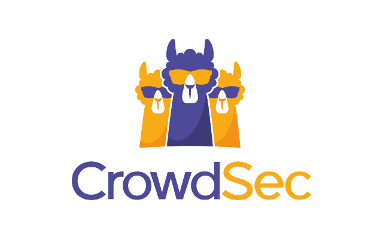

## CrowdSec Kubernetes Workshop

In this workshop, you will learn how to deploy the security engine (LAPI, log processor/agent, and remediation component) using the Helm chart, detect/block malicious behavior, and monitor activity on your Kubernetes cluster with Traefik as an Ingress Controller with TLS.

For this workshop, you will:

1- Set up the Kubernetes cluster

2- Install the Traefik Ingress Controller

3- Install CrowdSec

4- Install the remediation component middleware

5- Install the HelloWorld app

6- Test the setup

### CrowdSec Taxonomy

Word | Description
---|---
Signal | Local information on a given attack
LAPI | Local API. Used to control the various elements of the CrowdSec stack locally
CAPI | Gets blocklists from community, sends signals to smoke Database
Log processor | Does all parsing of logs and communicating with LAPI
Security Engine | Is the stack that contains LAPI and the Log processor
Remediation Component | IPS part of CrowdSec. Mitigates risks by ‘blocking’ malicious traffic
Parser | Parses logs. Written in YAML and GROK
Scenario | Describes the attack we want to react to
Collection | Collection of parsers and/or scenarios for one system or use case
Postoverflow | Action to execute when a given scenario has been triggered
Decision | Is generated when a scenario is triggered.
Alert | Decisions are transformed into alerts based on local preferences (e.g. a 4h ban).
